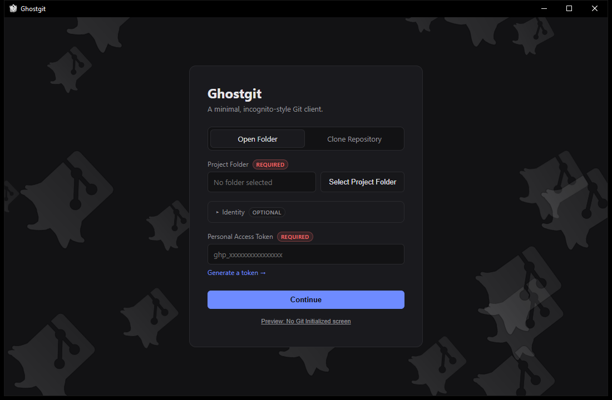
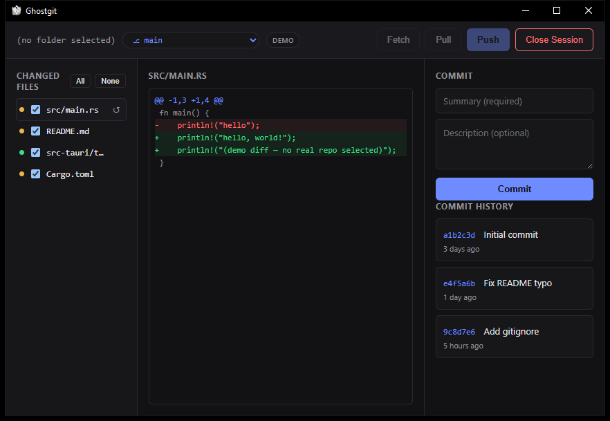
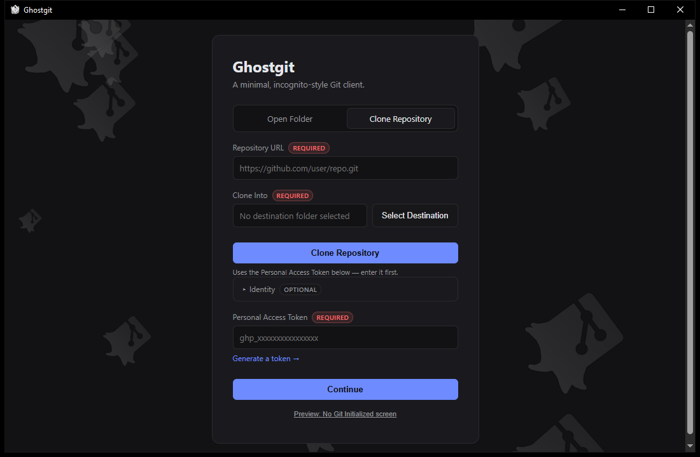

# Ghostgit

**Ghostgit** is a minimal, incognito-style Git GUI client for Windows, macOS, and Linux. Clone, commit, push, pull, and fetch on any machine without running `git config` or leaving a stored identity behind: point it at a folder or clone a repo, paste a GitHub token, and work. Close the session and every credential is gone.

Built with [Tauri](https://tauri.app), Rust, and [git2-rs](https://github.com/rust-lang/git2-rs) (libgit2), Ghostgit ships as a small native desktop binary — no Electron, no bundled Chromium, no background telemetry.

<p align="center">
  
  
</p>

## Why Ghostgit

Most Git GUIs assume you live in one repo, on one machine, with global `user.name`/`user.email` set forever. Ghostgit is built for the opposite case:

- **No stored git identity** — name, email, and Personal Access Token are entered per session, not written to global git config.
- **Incognito by design** — close the session and your credentials leave memory. Nothing lingers in a keychain or config file.
- **Works on borrowed or shared machines** — a lab computer, a shared workstation, a friend's laptop — without polluting it with your identity.
- **Minimal surface area** — no plugin ecosystem, no themes, no telemetry. Select a folder, review your diff, commit, push.

## Features

- **Clone a repository** by URL, or browse and pick from your own GitHub repositories once you've entered a token.
- **Changed files and diff view** — see modified, staged, and untracked files with inline diffs before you commit.
- **Select-what-you-commit** — pick individual files instead of committing everything by default.
- **Commit with summary and description**, and browse commit history with relative timestamps.
- **Branch switching** from a simple dropdown.
- **Fetch, pull (fast-forward), and push** against a remote, authenticated with a GitHub Personal Access Token.
- **`.gitignore`-aware staging** — ignored paths are refused at commit time, not silently included.
- **Repo initialization** — point Ghostgit at a plain folder and initialize it as a git repo in one click.
- **No persisted secrets** — your PAT lives only for the current session.

<p align="center">
  
</p>

## Installation

Ghostgit is a Tauri desktop app. To build it from source you'll need:

- [Node.js](https://nodejs.org/) (for the frontend tooling)
- [Rust](https://www.rust-lang.org/tools/install) (stable toolchain, for the Tauri backend)
- The [Tauri prerequisites](https://tauri.app/start/prerequisites/) for your OS (e.g. WebView2 on Windows, GTK/WebKitGTK on Linux)

```bash
git clone https://github.com/abduznik/ghostgit.git
cd ghostgit
npm install
npm run tauri dev
```

To produce an installable, platform-native binary (`.msi`/`.exe`, `.dmg`, `.AppImage`/`.deb`):

```bash
npm run tauri build
```

## Usage

1. **Open a folder or clone a repository** — pick an existing project folder, or switch to the Clone Repository tab to clone by URL (or browse your own GitHub repos once a token is entered).
2. **Enter your identity** (optional name/email) and a **GitHub Personal Access Token** (required for clone/push/pull/fetch). Nothing is written to global git config.
3. **Review changed files** in the sidebar and click any file to see its diff.
4. **Select the files you want**, write a commit summary, and commit.
5. **Fetch, pull, or push** using the toolbar — Ghostgit handles fast-forward merges and prompts you to set a remote if one isn't configured yet.
6. **Close Session** when you're done to clear the in-memory identity and token.

## Tech stack

| Layer | Technology |
|---|---|
| Shell | [Tauri 2](https://tauri.app) |
| Backend | Rust, [git2](https://github.com/rust-lang/git2-rs) (libgit2 bindings) |
| Frontend | Vanilla HTML/CSS/JS |
| Networking | `reqwest` (rustls) for GitHub token validation |

## Contributing

Issues and pull requests are welcome. If you're proposing a larger change, open an issue first to discuss the approach.

## License

[MIT](LICENSE) © abduznik
